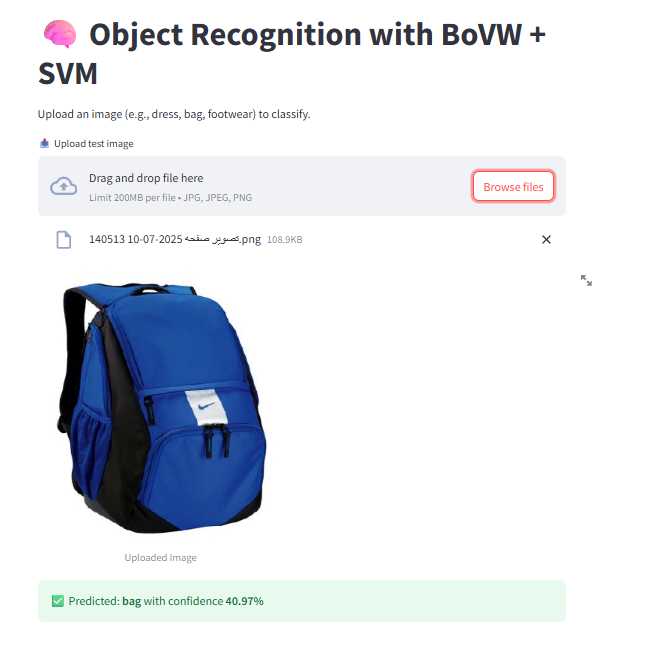

# 🧠 Object Recognition using Bag of Visual Words (BoVW) + SVM

This project implements a classic computer vision pipeline for object recognition using the **Bag of Visual Words (BoVW)** model combined with a **Support Vector Machine (SVM)** classifier.

The system is trained to recognize 3 object classes:
- 👗 Dress  
- 👠 Footwear  
- 🎒 Bag  

---

## ⚙️ How It Works

1. **SIFT Features** are extracted from training images  
2. All descriptors are clustered using **KMeans** to form the visual dictionary (codebook)  
3. Each image is converted into a **fixed-length histogram** of visual words  
4. A **Linear SVM** is trained on the histograms  
5. At prediction time, a test image is transformed into a histogram and passed to the SVM

---

## 📈 Current Accuracy

| Metric         | Value   |
|----------------|---------|
| Accuracy       | ~30–40% |
| Visual Words   | 150     |
| Features Used  | SIFT    |

⚠️ This is a prototype version with a small dataset (∼150 images/class). Accuracy will improve by:
- Adding more training data
- Balancing classes
- Using better background filtering or preprocessing
- Tuning the number of visual words and SVM kernel

---

## 🚀 How to Run

🔹 Train the model
Prepare training data
Place your images into subfolders inside the images/ folder like this:

Copy code
images/
├── dress/
├── footwear/
└── bag/

🔹 Train the model
    
    python train.py

This will create:

model/dictionary.pkl → KMeans visual words

model/svm_model.pkl → Trained classifier

model/label_names.pkl → Class labels

Use the Streamlit App
streamlit run predict_app.py

⚠️ Note: The model currently achieves around 30–40% accuracy.
This is a proof-of-concept implementation of the Bag of Visual Words + SVM pipeline.
Accuracy can be improved by increasing training data, using better features, or tuning hyperparameters.
